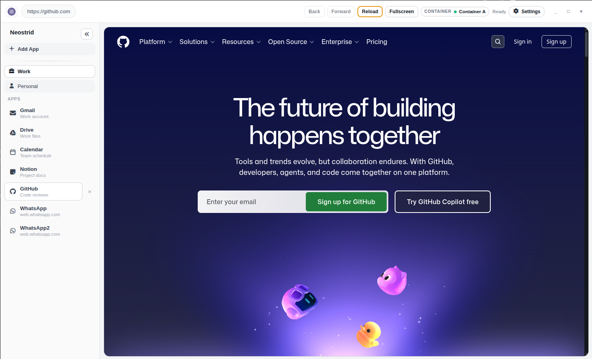
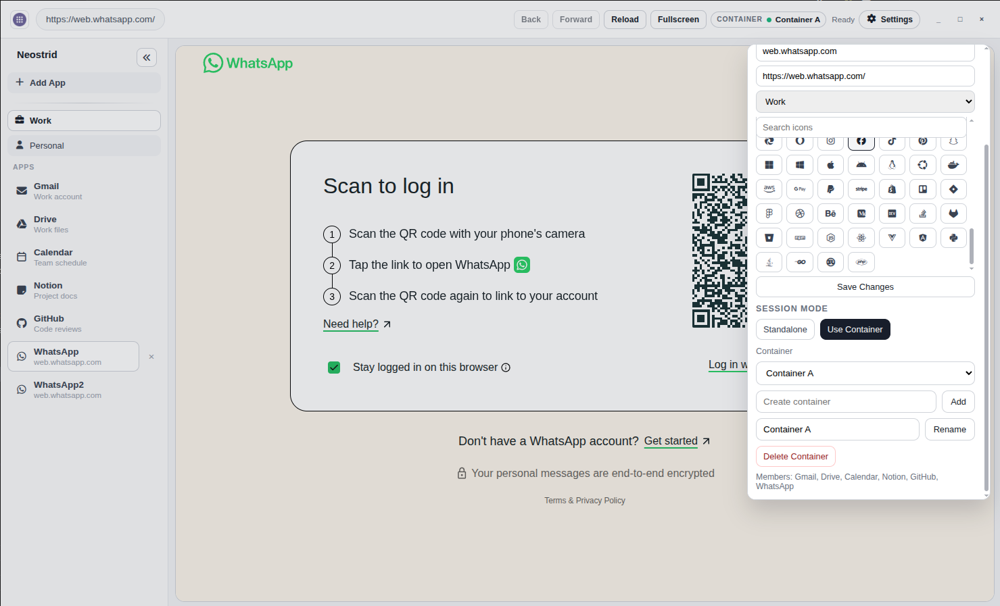

# Neostrid (Biscuit Clone)

Neostrid is a container-first desktop "app browser" inspired by the Biscuit app. It allows users to pin web applications into a sidebar and instantly switch between them. A core feature of Neostrid is session isolation: users can configure apps to run as standalone isolated sessions (no shared cookies) or group multiple apps into reusable "session containers" so that a single login can be shared across related services (e.g., Gmail and Google Drive). The app organizes these web apps into workspaces, persists application state between relaunches, and focuses on quick, keyboard-driven navigation.

## Screenshots





## Tech Stack
- **Runtime:** Electron (using TypeScript)
- **Frontend / UI:** React 19 + TypeScript
- **Build Tool:** Vite
- **State Management:** Zustand
- **Schema Validation:** Zod
- **Icons:** FontAwesome
- **Packaging & Distribution:** electron-builder

## Development

```bash
# Install dependencies
npm install

# Start development server
npm run dev
```

## Building

```bash
# Build for production
npm run build
```